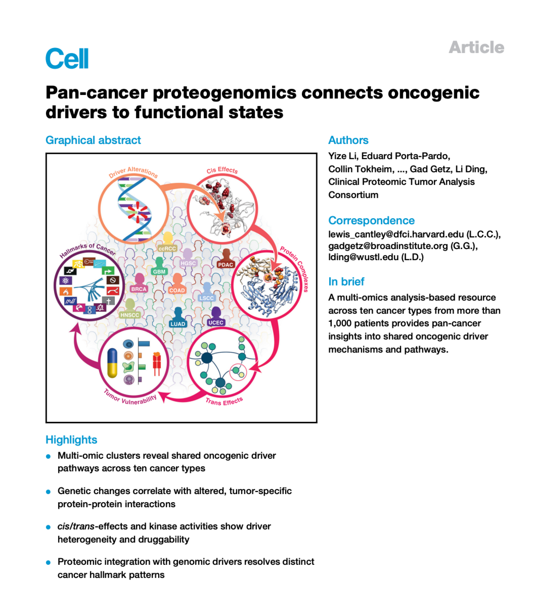
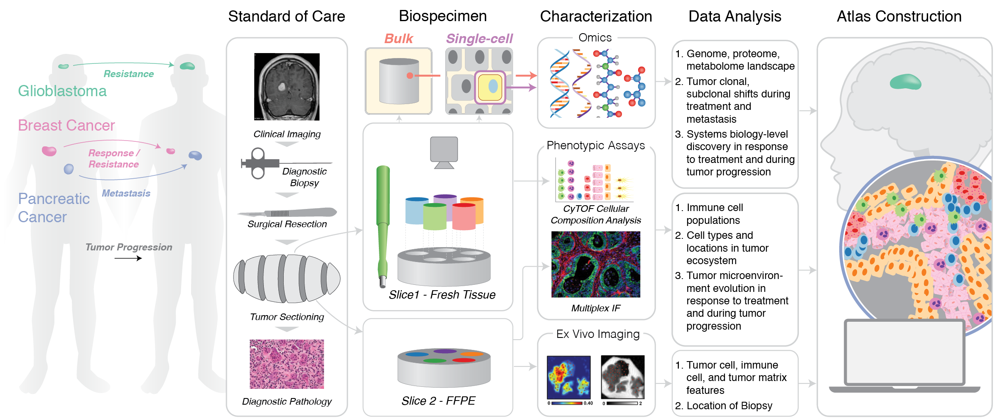
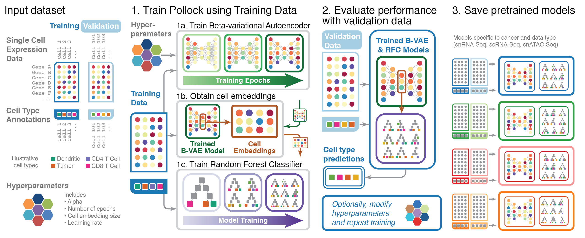
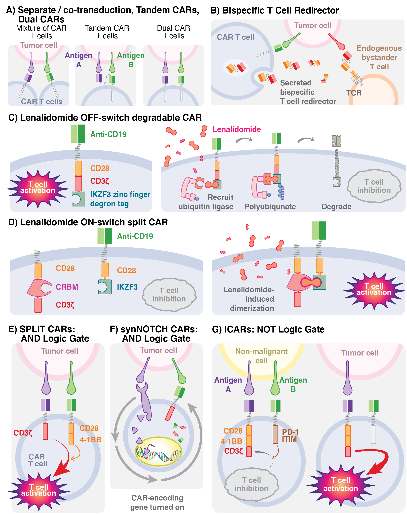
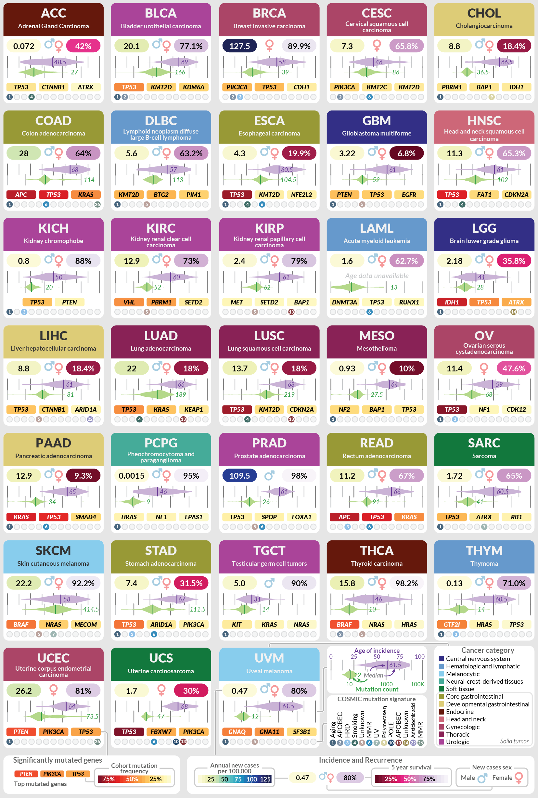
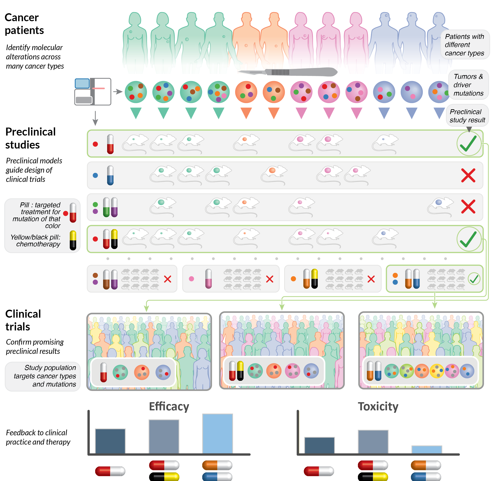
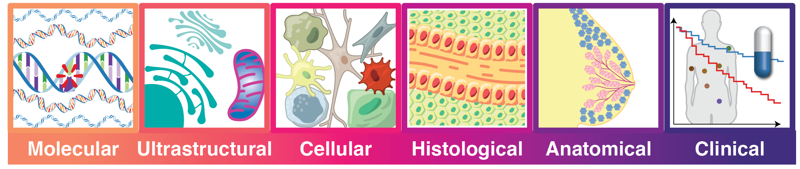
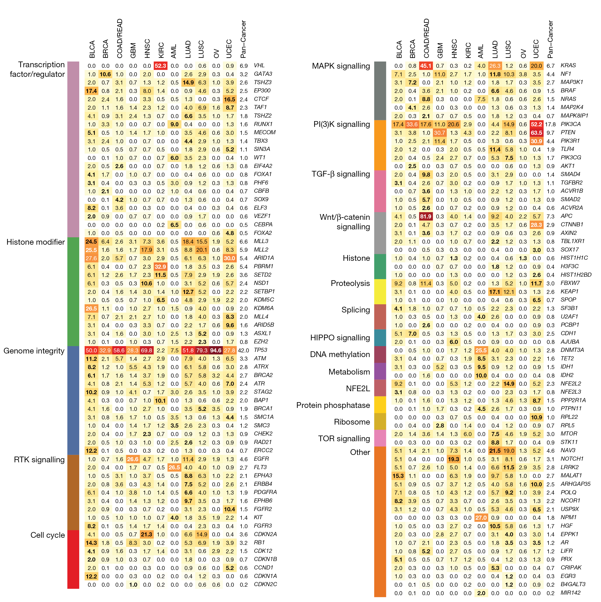

# Personal
## Matthew A. Wyczalkowski
[matt.wyczalkowski@gmail.com](mailto:matt.wyczalkowski@gmail.com)

LinkedIn

GitHub - mwyczalkowski
GitHub - dinglab

# Highlights
Include outstanding publications?  Link to HTAN?

# Portfolio

## Overview
This page provides examples of some of my work.

* [Scientific illustration and data visualization](#scientific-illustration-and-data-visualization)
* [Publications](#publications)
* [Scientific software](#scientific-software)

## Scientific illustration and data visualization
As a researcher in a [prominent cancer genomics research
lab)[https://dinglab.wustl.edu/], I developed a passion for and experience in
communicating complex scientific concepts through informative grapics.  I have
created figures for publications in prominent journals, and led illustration
design for a number of successful large scale grants.  Below is a representative selection of
my work, highlighting images which were published or in a
successful grant application.

### Graphical Abstract in Cell (2023)

A graphical summary of a manuscript published in Cell, illustrating the multi-scale analysis of ten cancer types to
provide insights into mechanisms driving cancer.

Li *et al.*, **Pan-cancer proteogenomics connects oncogenic drivers to functional states**.
Cell, Volume 186, Issue 18, 3921 - 3944.e25
[https://www.cell.com/cell/fulltext/S0092-8674\(23\)00780-8](https://www.cell.com/cell/fulltext/S0092-8674\(23\)00780-8)

### Summary figure for HTAN Center Grant Application (2018)

This illustration is the first figure in a grant application for the [Human
Tumor Atlas Network](https://www.cancer.gov/news-events/cancer-currents-blog/2019/human-tumor-atlas-network-cancer-maps),
providing a visual summary of the aims of the proposal.  This successful grant
application resulted in a $9.6M award to Washington
University (2018-2024).

### Visual summary of ML algorithm (2022)

A visual representation of the Machine Learning algorithm underlying the "Pollock" software package for the
classification of single cell transcriptome data.  

Storrs *et al.*, **Pollock: fishing for cell states**, Bioinformatics Advances,
Volume 2, Issue 1, 2022, vbac028,
[https://doi.org/10.1093/bioadv/vbac028](https://doi.org/10.1093/bioadv/vbac028)

### Next generation CAR-T cell modifications (2022)

Visual description of a variety of CAR-T technologies associated with cancer immunotherapy, one of 
a number of figures commissioned for the book, Gene and Cellular Immunotherapy for Cancer.

Ghobadi, A and JF DiPersio.  **Gene and Cellular Immunotherapy for Cancer**.  Humana Press, 2022.
[https://link.springer.com/book/10.1007/978-3-030-87849-8](https://link.springer.com/book/10.1007/978-3-030-87849-8)

### Key characteristics of cancers learned from TCGA (2021)

Published as part of a retrospective on the landmark TCGA cancer genomics
program, this is a visual representation of the key findings of genomics analyses
across 33 cancer types.  Each panel provides a concise summary of 
findings for each cancer, including incidence and survival rates,
mutational signatures and associated driver genes.

Chen, F., Wendl, M.C., Wyczalkowski, M.A. *et al*. **Moving pan-cancer studies from basic research toward the clinic.** 
Nat Cancer 2, 879–890 (2021). [https://doi.org/10.1038/s43018-021-00250-4](https://doi.org/10.1038/s43018-021-00250-4)

### Sample collection plan for PE-CGS grant (2020)

A proposed sample collection and data generation schedule for the PE-CGS grant, illustrating
the complex relationship between sample collection from a variety of sources and analysis over time.  This figure was
part of a successful grant application, resulting in an award to Washigton University of $17.7M (2021-2026).

### Therapeutic targets and treatment responses across cancer types (2021)

Illustration of a strategy for preclinical studies and clinical trials based on
molecular features.

Chen, F., Wendl, M.C., Wyczalkowski, M.A. *et al*. **Moving pan-cancer studies from basic research toward the clinic.** 
Nat Cancer 2, 879–890 (2021). [https://doi.org/10.1038/s43018-021-00250-4](https://doi.org/10.1038/s43018-021-00250-4)

### HTAN data collection at multiple scales (2024)

Visual representation of data collection across spatial scales for the HTAN
project.  A version of this illustration was published as part of a Nature
special feature on the Human Tumor Atlas Network:
[https://www.nature.com/immersive/d42859-024-00059-y/index.html](https://www.nature.com/immersive/d42859-024-00059-y/index.html)

### Genetic mutations across cancer types (2013)

Key figure in a landmark paper published in Nature illustrating patterns of genetic mutations across cancer types.

Kandoth, C., McLellan, M., Vandin, F. *et al*. **Mutational landscape and
significance across 12 major cancer types.** Nature 502, 333–339 (2013).
[https://doi.org/10.1038/nature12634](https://doi.org/10.1038/nature12634)

### Collection protocol and naming scheme for HTAN2 grant application (2024)

This figure illustates the proposed collection scheme for specimens from a trial participant, yielding a variety of omics-based analyses.
It also describes the naming scheme developed in our lab and used for specimen collection and tracking.
Figure was part of a successful grant application to HTAN2, with an estimated $17M awarded to Washington University (2024 - 2029).

# Publications
Outstanding publications include,
* A
* B
* C 

A comprehensive [list of my publications can be found here](Publications.md)

# Scientific Software

TinDaisy https://github.com/ding-lab/TinDaisy
A SNP / Indel variant caller used for paired tumor / normal variant calling for studying mutations driving cancer.
Used extensively for CPTAC3 and GDAN consortia, processed XXX cases, with YYY publications to date.

Breakpoint Surveyor https://github.com/ding-lab/BreakPointSurveyor
A pipeline for the analysis and visualization of complex structural variants.  Developed for the analysis of virus integrations
in TCGA whole genome data, resulting in the publication 
(cite)
